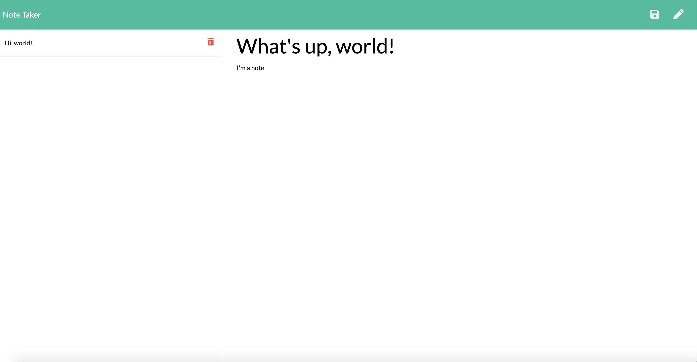

# Notes-App

Deployed application: https://agile-lake-97237.herokuapp.com/

This is a note-taking application. Users can write a new note by clicking the pencil icon. The note can then be saved to a sidebar by clicking the save icon. Once the saved notes appear on the sidebar, they can be viewed by clicking on the relevant section of the sidebar,and they can be deleted by clicking the trash icon. 

The application frontend (index.js, styles.css, index.html, and notes.html) was pre-created and required only a couple of minor adjustments by me. My overarching task was to build the application backend and connect the application backend with the pre-existing application frontend. 

First, I setup a "database" file (db.json) to store all the notes that a user writes. Then, I used express to establish a server and routes that would be used to send HTML files upon a request. Later, I established api routes to draw JSON data from the db.json "database" and provide it to the frontend upon request so that a user's notes could be provided to the frontend. 

